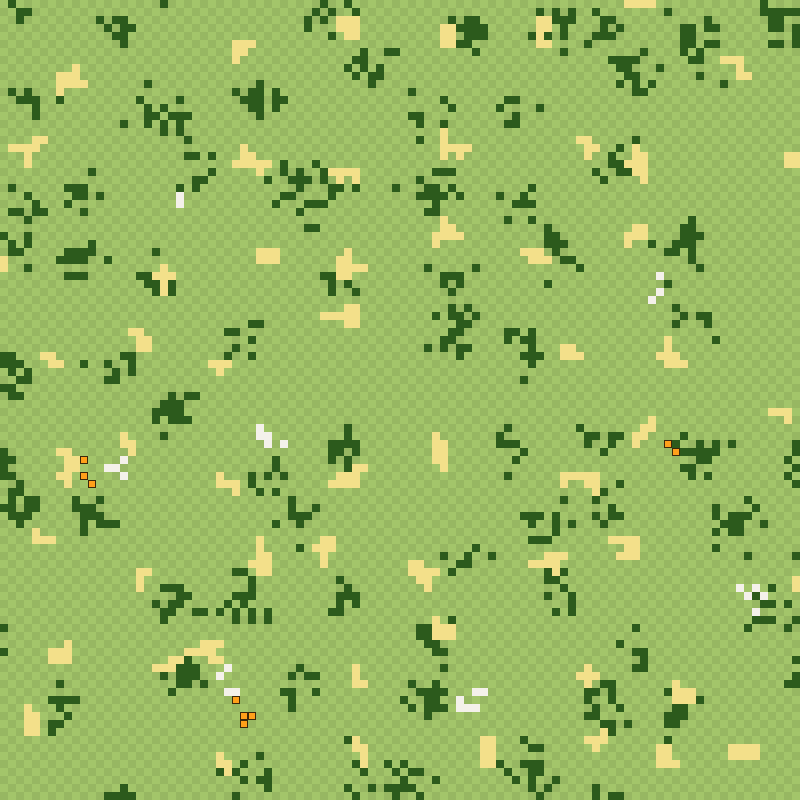
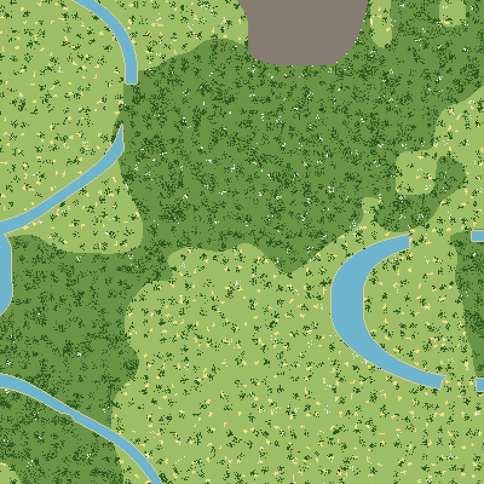
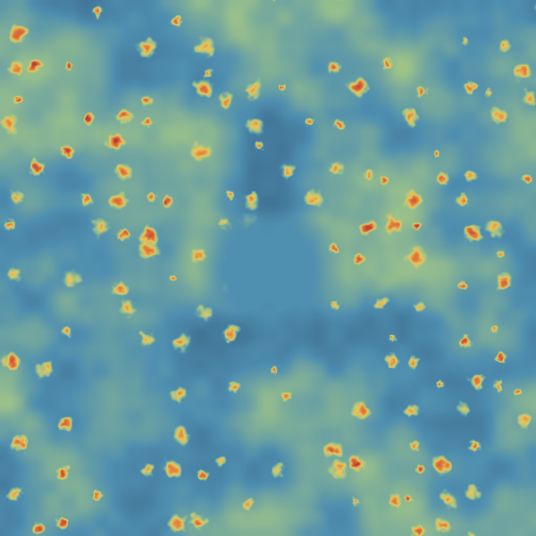

# Resource Distribution Spec

How resource nodes are spread across the world so that:
- every player can start;
- good sites are rare enough to fight over;
- high-elo pockets are worth the danger;
- the map looks natural, with clusters and not evenly sprinkled dust.

**Code:** `packages/worldgen/src/resources.ts`
**Balance simulator:** `packages/worldgen/sim/balance.ts`
**Previews:** `sim/preview.ts`

Everything here serves the adjacency economy ([economy.md](economy.md) §1): buildings produce from the nodes within 3 squares, and construction uses nodes anywhere in the 21×21 city area.

## 1. Balance targets

Balance is measured at the scale that matters to a player: **a candidate city site**, meaning a buildable square plus everything within a king's 10-square reach. The simulator samples thousands of such sites, stratified by elo band, and checks them against these targets:

| # | Target | Why |
|---|---|---|
| B1 | **≥ 90%** of low-elo sites are *start-viable* (≥ 4 trees and ≥ 3 wheat squares) | Almost anywhere works as a first city. Spawning picks only viable sites, so this just needs to be high enough to find one quickly. |
| B2 | **50–75%** of low-elo sites have rock in reach | Barracks and palaces need stone. It should be common, but choosing a site should still matter. |
| B3 | **6–15%** of low-elo sites have gold in reach | Gold is the rare prize. |
| B4 | **3–8%** of low-elo sites are *palace sites* (gold and rock within 8 squares of each other, so one 3×3 palace's work area covers both) | Palace sites are the most valuable land in the game. |
| B5 | **12–30%** of sites at elo 2000+ are palace sites | Several times more common in high-elo pockets, which is the reward for playing there. |
| B6 | 99th-percentile distance to the nearest wood ≤ 20, wheat ≤ 25, rock ≤ 50; 90th-percentile to gold ≤ 150 (new-player zone) | Bounded gaps: nobody spawns in a desert. |
| B7 | Clark–Evans ratio R: wood ≤ 0.8, wheat ≤ 0.7, rock ≤ 0.7, gold ≤ 0.6 | Measurably clustered. R = 1 is random scatter; lower is clumpier. |

Run `node sim/balance.ts [sitesPerBand] [seeds]`. It prints a PASS/FAIL table, exits non-zero on a failure (so it can run in CI), and writes `sim/out/report.json`.

## 2. The algorithm: layers of clusters on jittered grids

Each resource is its own **layer**. A layer is a grid of cells, each `c × c` squares. Each cell may hold one **cluster**, decided like this:

```
for each cell (i, j) of layer L:
    r      = rng(hash(seed, i, j, L.salt))              # the cell's own deterministic RNG
    center = ((i + 0.15 + 0.7·r()) · c,  (j + 0.15 + 0.7·r()) · c)
    site   = terrain, height, moisture, elo at center
    if r() ≥ L.chance(site): no cluster
    size   = uniform integer in L.size
    place `size` nodes around center:
        scatter: Gaussian offsets with σ = L.spread     (groves, outcrops, veins)
        blob:    grow a connected patch from the center (wheat fields)
    each node must sit on terrain that can hold it; otherwise that try is skipped
    gold only: with probability 0.6, add a 2–4-node rock outcrop 3–5 squares away
```

Two per-square **fill** layers are added on top:
- forest trees, thinned into patches by small-scale noise;
- a little rock along mountain edges.

When layers claim the same square, a priority decides: gold > rock > wheat > tree.

### Why jittered grids and not pure random placement

- **Bounded gaps (guarantees B6):** each cell's center is jittered within the middle 70% of the cell. So two neighboring centers are at most 1.7c apart and at least 0.3c apart. Pure random (Poisson) placement has no upper bound on gaps: some players would spawn a long way from any wheat.
- **Randomness where it looks natural:** it appears in each cell's roll, the jitter, the cluster size, and the shape. The map looks organic while the worst case stays bounded.
- **Local and deterministic:** any square's resources depend only on the few cells within reach (≤ 12 squares). A chunk, or a single city site, can be generated on its own, on the client or the server, with identical results ([TECH.md](../TECH.md) T8).

### Coverage math (how the knobs map to the targets)

Take a city window of side `w = 21` and clusters that extend about `ρ` squares around their center. A cluster reaches the window if its center lands in a `(w + 2ρ)²` box. Each cell contributes about `k = (w + 2ρ)² / c²` chances, so:

```
P(site has layer L in reach) ≈ 1 − (1 − p̄)^k        p̄ = average chance over the local terrain
```

| Layer | c | ρ | k | p̄ (low elo) | Predicted | Measured (low elo) |
|---|---|---|---|---|---|---|
| Rock outcrops (+ mountain-edge fill and gold companions) | 20 | ~2 | 1.6 | ~0.4 | ~56% | **54.6%** |
| Gold veins | 30 | ~1.5 | 0.64 | ~0.14 | ~9% | **7.0%** |

- The measured values run a little low because some cluster centers land on water or mountain and are dropped.
- Wood and wheat use small cells (`c = 11` and `c = 13`) with high chance, so `k ≈ 3–4` and coverage is close to 100%.
- **To retune:** coverage is controlled by `c` and `chance`; how much a site yields is controlled by `size` and capacity. Change one side without disturbing the other.

### Elo scaling

- **Gold chance:** `(0.14 + 0.5 · eloFactor) × heightMod`, where `eloFactor` goes from 0 at elo 1000 to 1 at elo 2400. That makes gold about 4× as common in the strongest pockets.
- **Node capacity:** `base × richness(elo) × U(0.8, 1.2)`, where `richness = clamp(1 + (elo − 1000)/2000, 0.7, 1.9)`. High-elo mines last almost twice as long.
- Base capacity: tree 200, wheat 100 per harvest, rock 400, gold 150.

## 3. Layer parameters (current)

| Layer | Kind | Cell | Size | Shape | Chance |
|---|---|---|---|---|---|
| grove | tree | 11 | 7–16 | scatter σ 1.5 | forest 0.95, grass 0.8, other 0.4 |
| field | wheat | 13 | 4–9 | blob (connected) | grass: 0.55–0.95, peaking at middling moisture; other 0.25 |
| outcrop | rock | 20 | 2–6 | scatter σ 1.4 | 0.2 → 0.9 with height |
| vein | gold | 30 | 2–4 | scatter σ 1.0, plus a rock companion 60% of the time | see Elo scaling |
| forest fill | tree | per square | – | noise-thinned patches | up to ~50% in dense patches |
| mountain edge | rock | per square | – | – | 6% of squares next to a mountain |

Nodes can sit on: trees on grass or forest; wheat on grass only; rock and gold on any walkable terrain.

## 4. Results (3 seeds, 750 sites per elo band)

| Check | Value | Target | |
|---|---|---|---|
| Start-viable sites (low elo) | 92.2% | ≥ 90% | ✅ |
| Rock in reach (low elo) | 54.6% | 50–75% | ✅ |
| Gold in reach (low elo) | 7.0% | 6–15% | ✅ |
| Palace sites (low elo) | 5.2% | 3–8% | ✅ |
| Palace sites (elo 2000+) | 18.7% | 12–30% | ✅ |
| Nearest wood / wheat / rock, 99th pct | 9 / 15 / 42 | ≤ 20 / 25 / 50 | ✅ |
| Nearest gold, 90th pct | 62 | ≤ 150 | ✅ |
| Clark–Evans R: wood / wheat / rock / gold | 0.65 / 0.24 / 0.21 / 0.05 | clustered | ✅ |

| Elo band | Viable | Rock | Gold | Palace | Avg wood capacity | Avg rock capacity | Avg gold capacity |
|---|---|---|---|---|---|---|---|
| < 1000 | 93% | 54% | 7% | 5% | 6,073 | 821 | 27 |
| 1000–1500 | 92% | 55% | 7% | 5% | 6,979 | 948 | 28 |
| 1500–2000 | 93% | 58% | 19% | 12% | 8,788 | 1,303 | 102 |
| 2000+ | 92% | 61% | 28% | 19% | 10,316 | 1,655 | 172 |

The spread in site value (coefficient of variation ≈ 0.33 in every band) is the "random variation": sites really do differ, and the spread is the same at every elo level.

## 5. Previews

Legend:
- Terrain: light green is grass, darker green is forest, blue is water (the rivers have walkable fords), grey is mountain.
- Resources: dark green dots are trees, pale yellow is wheat, white is rock, orange is gold.

| Close-up (100×100 near spawn) | High-elo pocket (400×400) | Elo map (40,000×40,000) |
|---|---|---|
|  |  |  |

On the elo map, blue is low, green is middling, and orange to red is high. The flat, smoothly faded middle is the new-player zone around the origin. The red blobs are the high-elo pockets, with noise-warped irregular edges.

## 6. What's next

- **Depletion and regrowth** are runtime state (chunk changes), not worldgen. Worldgen only defines the starting state.
- Mountain-edge rock counts toward B2. If mountains get rarer, raise `outcrop.chance` to compensate. The simulator will catch it.
- **Spawn search:** pick random low-elo squares, keep the first site that's start-viable and at least 40 squares from any city. B1 = 92% means about 1.1 tries on average.
- Add `sim/balance.ts` to CI with a small sample (for example 100 sites per band on one seed) as a regression guard, plus a snapshot test that a fixed seed's chunk (0, 0) doesn't change without anyone noticing.
